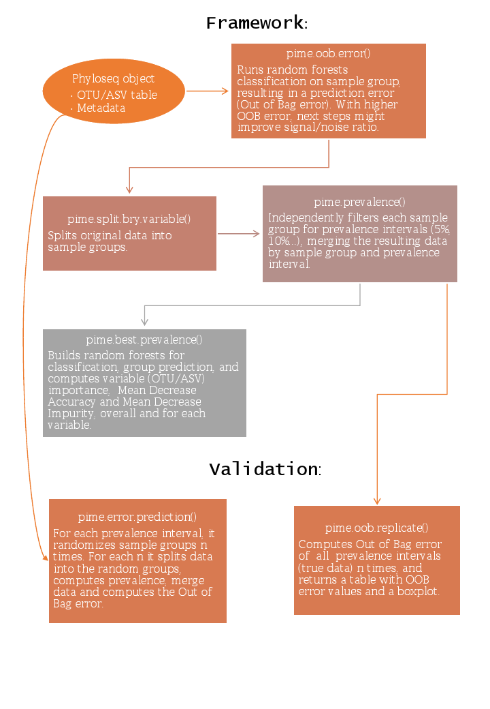

PIME: Prevalence Interval for Microbiome Evaluation
===================================================


PIME removes the within group variation found in metataxonomic surveys (16S rRNA datasets) by capturing only biological differences at high samples prevalence levels.

First steps: installing 'phyloseq' and creating a 'phyloseq' object
===================================================================

To install phyloseq start R and enter:

``` r
if (!requireNamespace("BiocManager", quietly = TRUE))
    install.packages("BiocManager")
BiocManager::install("phyloseq")
```

Phyloseq aggregates, mainly, an otu\_table (with OTUs abundances), tax\_table (taxonomy), and a sample\_data (sample information) objects.

Importing output from DADA2

``` r
seqtab = readRDS("path_to_file/sequence_table_final.rds")
tax= readRDS("path_to_file/tax_final.rds")
map <- "path_to_file/sample_data.txt"
ps <- phyloseq(otu_table(seqtab, taxa_are_rows=FALSE), 
               tax_table(taxa))
sample_metadata = import_qiime_sample_data(map)
physeq =merge_phyloseq(ps, sample_metadata)
```

Importing otu\_table as a biom file with taxonomy

``` r
jsonbiomfile = "path_to_file/otu_table_fix.biom"
mapfile = "path_to_file/v35_map_uniquebyPSN.txt"
biom = import_biom(jsonbiomfile, mapfile, parseFunction=parse_taxonomy_greengenes)
map = import_qiime_sample_data(mapfile)
input = merge_phyloseq(biom,map)
```

For further data input methods and examples go to <https://joey711.github.io/phyloseq/import-data.html>

How to install PIME package
===========================

To install PIME first install the devtools package. Then load the library(devtools) and run install\_github using the following commands.

``` r
#install.packages("devtools")
library(devtools)
install_github("microEcology/pime")
```

PIME uses a Phyloseq object as input. A description of the phyloseq object and a tutorial on how to create this file in R using OTU tables in many different formats is detailed into the Phyloseq website <https://joey711.github.io/phyloseq/>

Step-by-step example
====================



The first step in PIME is to define if the microbial community presents a high relative abundance of taxa with low prevalence, which is considered as noise in PIME analysis. This is calculated by random forests analysis. In this example we run PIME using the restroom dataset (<https://doi.org/10.1007%2Fs10482-017-0976-6>) against the metadata variable called Environment (a variable with two categories: men’s and women’s restroom).

Prediction using random forests on full dataset. Results in Out of Bag error rate. The input file was rarefied at 500 sequences for the purpose of this example (speed up the analysis). Using a rarefied dataset is recommended at this step.

``` r
library(pime)
data("restroom")
pime.oob.error(restroom, "Environment")
#> [1] 0.5
```

The OOB error rate &lt;=0.1, indicated the dataset present large differences, and pime might not remove much of the noise. Higher OOB error rate indicates that the next functions should be run to find the best prevalence interval for the dataset.

This function takes two parameters: The phyloseq object (restroom) and the predictor variable (Environment).

Split the dataset by predictor variable
---------------------------------------

Two parameters are required to run this function: The phyloseq object (restroom) and the predictor variable (Environment).

``` r
per_variable_obj= pime.split.by.variable(restroom, "Environment")
per_variable_obj
#> $Restroom_F
#> phyloseq-class experiment-level object
#> otu_table()   OTU Table:         [ 1858 taxa and 9 samples ]
#> sample_data() Sample Data:       [ 9 samples by 6 sample variables ]
#> tax_table()   Taxonomy Table:    [ 1858 taxa by 7 taxonomic ranks ]
#> 
#> $Restroom_M
#> phyloseq-class experiment-level object
#> otu_table()   OTU Table:         [ 1983 taxa and 9 samples ]
#> sample_data() Sample Data:       [ 9 samples by 6 sample variables ]
#> tax_table()   Taxonomy Table:    [ 1983 taxa by 7 taxonomic ranks ]
```

Calculate the highest possible prevalence intervals
---------------------------------------------------

This function calculates prevalence for different intervals by increments of 5. The input file is the output from the pime.split.by.variable(per\_variable\_obj)

``` r
prevalences=pime.prevalence(per_variable_obj)
head(prevalences)
#> $`5`
#> phyloseq-class experiment-level object
#> otu_table()   OTU Table:         [ 3253 taxa and 18 samples ]
#> sample_data() Sample Data:       [ 18 samples by 6 sample variables ]
#> tax_table()   Taxonomy Table:    [ 3253 taxa by 7 taxonomic ranks ]
#> 
#> $`10`
#> phyloseq-class experiment-level object
#> otu_table()   OTU Table:         [ 3253 taxa and 18 samples ]
#> sample_data() Sample Data:       [ 18 samples by 6 sample variables ]
#> tax_table()   Taxonomy Table:    [ 3253 taxa by 7 taxonomic ranks ]
#> 
#> $`15`
#> phyloseq-class experiment-level object
#> otu_table()   OTU Table:         [ 593 taxa and 18 samples ]
#> sample_data() Sample Data:       [ 18 samples by 6 sample variables ]
#> tax_table()   Taxonomy Table:    [ 593 taxa by 7 taxonomic ranks ]
#> 
#> $`20`
#> phyloseq-class experiment-level object
#> otu_table()   OTU Table:         [ 593 taxa and 18 samples ]
#> sample_data() Sample Data:       [ 18 samples by 6 sample variables ]
#> tax_table()   Taxonomy Table:    [ 593 taxa by 7 taxonomic ranks ]
#> 
#> $`25`
#> phyloseq-class experiment-level object
#> otu_table()   OTU Table:         [ 222 taxa and 18 samples ]
#> sample_data() Sample Data:       [ 18 samples by 6 sample variables ]
#> tax_table()   Taxonomy Table:    [ 222 taxa by 7 taxonomic ranks ]
#> 
#> $`30`
#> phyloseq-class experiment-level object
#> otu_table()   OTU Table:         [ 222 taxa and 18 samples ]
#> sample_data() Sample Data:       [ 18 samples by 6 sample variables ]
#> tax_table()   Taxonomy Table:    [ 222 taxa by 7 taxonomic ranks ]
```

Calculate the best prevalence interval for the dataset
------------------------------------------------------

This function will return a table with Out of Bag error from random forests for each prevalence interval. The number of taxa and the number of remaining sequences for each prevalence interval are also computed. The best prevalence interval value provides the clearest separation of communities while still including a majority of the taxa in the analysis. If true differences are present. It will be represented by the first interval in which the OOB error rate is zero or close to zero. The input file is the list of prevalences generated by the pime.prevalence (prevalences) and the predictor variable ("Environment"").

``` r
set.seed(42)
best.prev=pime.best.prevalence(prevalences, "Environment")
#>        Interval OOB error rate (%) OTUs Nseqs
#>   Prevalence 5%              55.56 3253  9000
#>  Prevalence 10%                 50 3253  9000
#>  Prevalence 15%              11.11  593  5438
#>  Prevalence 20%              11.11  593  5438
#>  Prevalence 25%              11.11  222  4370
#>  Prevalence 30%              11.11  222  4370
#>  Prevalence 35%               5.56  117  3835
#>  Prevalence 40%               5.56  117  3835
#>  Prevalence 45%                  0   77  3531
#>  Prevalence 50%                  0   77  3531
#>  Prevalence 55%               5.56   77  3531
#>  Prevalence 60%                  0   45  3088
#>  Prevalence 65%                  0   45  3088
#>  Prevalence 70%                  0   26  2617
#>  Prevalence 75%                  0   26  2617
#>  Prevalence 80%                  0   16  2084
#>  Prevalence 85%                  0   16  2084
#>  Prevalence 90%                  0    4  1489
#>  Prevalence 95%                  0    4  1489
```

In addition, it also returns the results from the random forests classification for each prevalence level. It includes SequenceID (OTU/ASV), Mean Decrease Accuracy (MDA) for each sample group, that is how much that SequenceID was important for classification of that group. The Mean Decrease Impurity (Gini Importance) and taxonomy are also included.

To get the table with OTU/ASV importance of the chosen prevalence interval. Pime keeps only the top 30 OTUs/ASVs, with highest MDA.

``` r
imp65=best.prev$`Importance`$`Prevalence 65`
knitr::kable(head(imp65), format="markdown")
```

<table>
<colgroup>
<col width="6%" />
<col width="5%" />
<col width="5%" />
<col width="10%" />
<col width="8%" />
<col width="6%" />
<col width="9%" />
<col width="11%" />
<col width="10%" />
<col width="11%" />
<col width="9%" />
<col width="4%" />
</colgroup>
<thead>
<tr class="header">
<th align="left">SequenceID</th>
<th align="right">Restroom_F</th>
<th align="right">Restroom_M</th>
<th align="right">MeanDecreaseAccuracy</th>
<th align="right">MeanDecreaseGini</th>
<th align="left">Rank1</th>
<th align="left">Rank2</th>
<th align="left">Rank3</th>
<th align="left">Rank4</th>
<th align="left">Rank5</th>
<th align="left">Rank6</th>
<th align="left">Rank7</th>
</tr>
</thead>
<tbody>
<tr class="odd">
<td align="left">denovo87919</td>
<td align="right">0.0909333</td>
<td align="right">0.0883333</td>
<td align="right">0.0804214</td>
<td align="right">1.3798848</td>
<td align="left">k__Bacteria</td>
<td align="left">p__Firmicutes</td>
<td align="left">c__Bacilli</td>
<td align="left">o__Lactobacillales</td>
<td align="left">f__Lactobacillaceae</td>
<td align="left">g__Lactobacillus</td>
<td align="left">s__iners</td>
</tr>
<tr class="even">
<td align="left">denovo22521</td>
<td align="right">0.0420333</td>
<td align="right">0.0257333</td>
<td align="right">0.0312325</td>
<td align="right">0.8396941</td>
<td align="left">k__Bacteria</td>
<td align="left">p__Proteobacteria</td>
<td align="left">c__Gammaproteobacteria</td>
<td align="left">o__Pseudomonadales</td>
<td align="left">f__Pseudomonadaceae</td>
<td align="left">g__Pseudomonas</td>
<td align="left">s__</td>
</tr>
<tr class="odd">
<td align="left">denovo65044</td>
<td align="right">0.0282000</td>
<td align="right">0.0372857</td>
<td align="right">0.0292992</td>
<td align="right">0.6619939</td>
<td align="left">Unassigned</td>
<td align="left">NA</td>
<td align="left">NA</td>
<td align="left">NA</td>
<td align="left">NA</td>
<td align="left">NA</td>
<td align="left">NA</td>
</tr>
<tr class="even">
<td align="left">denovo6450</td>
<td align="right">0.0302667</td>
<td align="right">0.0171000</td>
<td align="right">0.0215468</td>
<td align="right">0.4021410</td>
<td align="left">k__Bacteria</td>
<td align="left">p__Proteobacteria</td>
<td align="left">c__Alphaproteobacteria</td>
<td align="left">o__Sphingomonadales</td>
<td align="left">f__Sphingomonadaceae</td>
<td align="left">g__Sphingomonas</td>
<td align="left">s__</td>
</tr>
<tr class="odd">
<td align="left">denovo1419</td>
<td align="right">0.0098000</td>
<td align="right">0.0197000</td>
<td align="right">0.0127857</td>
<td align="right">0.3298748</td>
<td align="left">k__Bacteria</td>
<td align="left">p__Actinobacteria</td>
<td align="left">c__Actinobacteria</td>
<td align="left">o__Bifidobacteriales</td>
<td align="left">f__Bifidobacteriaceae</td>
<td align="left">NA</td>
<td align="left">NA</td>
</tr>
<tr class="even">
<td align="left">denovo88424</td>
<td align="right">0.0098667</td>
<td align="right">0.0168667</td>
<td align="right">0.0122939</td>
<td align="right">0.3698211</td>
<td align="left">k__Bacteria</td>
<td align="left">p__Actinobacteria</td>
<td align="left">c__Actinobacteria</td>
<td align="left">o__Actinomycetales</td>
<td align="left">f__Corynebacteriaceae</td>
<td align="left">g__Corynebacterium</td>
<td align="left">s__</td>
</tr>
</tbody>
</table>

``` r

#To get the table with OOB error results.
#best.prev$`OOB error`
```

Within this dataset the best prevalence interval was 65%
--------------------------------------------------------

To obtain the phyloseq object at this cutoff use the following command.

``` r
prevalence.65 = prevalences$`65`
prevalence.65
#> phyloseq-class experiment-level object
#> otu_table()   OTU Table:         [ 45 taxa and 18 samples ]
#> sample_data() Sample Data:       [ 18 samples by 6 sample variables ]
#> tax_table()   Taxonomy Table:    [ 45 taxa by 7 taxonomic ranks ]
```

Estimating prediction error
---------------------------

To estimate error in prediction, we will use pime.error.prediction() to randomly assign treatments to samples and run random forests classification on each prevalence interval. The function returns a boxplot and a table with results of each classification error. For the purposes of this example we are running only 10 randomizations for saving time but we recommend at least 100 randomizations to obtain reliable results.

``` r
randomized=pime.error.prediction(restroom, "Environment", bootstrap = 10, parallel = TRUE, max.prev = 95)
randomized$Plot
randomized$'Table results'
```

It is also possible to estimate the variation of OOB error with each prevalence interval filtering. This is done by running the random forests classification for n times, determined by the user. This function will return a boxplot figure and a table for each classification error.

``` r
replicated.oob.error= pime.oob.replicate(prevalences, "Environment", bootstrap = 10, parallel = TRUE)
```

Getting Help
============

Please contact us if you need any help: *<contact@brmicrobiome.org>*

PIME Team
=========

Luiz F. W. Roesch (Universidade Federal do Pampa - Brazil)

Priscila T. Dobbler (Universidade Federal do Pampa - Brazil)

Victor S. Pylro (Universidade Federal de Lavras - Brazil)

Bryan Kolaczkowski (University of Florida - United States of America)

Jennifer C. Drew (University of Florida - United States of America)

Eric W. Triplett (University of Florida - United States of America)

Citation
========

Roesch et al. (2018), PIME: including the concept of prevalence for uncovering differences in microbiome noised data. Frontiers, submitted.
